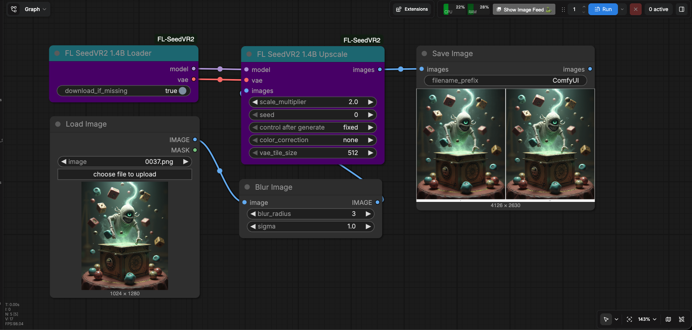

# FL SeedVR2

Native ComfyUI image restoration and upscaling nodes for the six-block
[SeedVR2 1.4B](https://huggingface.co/lvladikov/SeedVR2-1.4B) model.

[](https://huggingface.co/lvladikov/SeedVR2-1.4B)
[](https://www.patreon.com/Machinedelusions)



This pack uses ComfyUI's built-in SeedVR2 model, VAE, sampler, tiling, device
management, and offloading. It does not bundle a second SeedVR2 implementation
or patch ComfyUI at import time.

## Features

- **One-step restoration** - Denoise, deblur, sharpen, and restore image detail
- **1x to 8x scaling** - 4x is the recommended default
- **Automatic model setup** - Downloads the pinned transformer and VAE into the
  standard ComfyUI model folders
- **Verified downloads** - Resumable transfers with file-size, model-header, and
  SHA-256 validation
- **ComfyUI-native execution** - Uses the built-in SeedVR2 model path and memory
  management
- **Batch and alpha support** - Processes image batches independently and
  preserves RGBA alpha
- **FL styling** - Matches the title and body colors used by other FL node packs

## Nodes

| Node | Description |
|------|-------------|
| **FL SeedVR2 1.4B Loader** | Loads the pinned 1.4B transformer and VAE, with optional automatic download |
| **FL SeedVR2 1.4B Upscale** | Restores and upscales an image or independent image batch |

Both nodes appear under `FL/SeedVR2`.

## Installation

### ComfyUI Manager

Search for **ComfyUI-FL-SeedVR2** and install it, then restart ComfyUI.

### Manual

```bash
cd ComfyUI/custom_nodes
git clone https://github.com/filliptm/ComfyUI-FL-SeedVR2.git
```

Restart ComfyUI after installation. This pack uses the dependencies already
provided by ComfyUI.

## Quick Start

1. Add **FL SeedVR2 1.4B Loader**.
2. Add **FL SeedVR2 1.4B Upscale**.
3. Connect the loader's `MODEL` and `VAE` outputs to the upscale node.
4. Connect an `IMAGE` and queue the prompt.
5. On first use, allow the loader to finish downloading and verifying both
   model files.

The upscale node outputs a standard ComfyUI `IMAGE`. An editable four-node
workflow is included at
[`examples/seedvr2_1_4b_upscale.json`](examples/seedvr2_1_4b_upscale.json).

Recommended settings:

```text
scale_multiplier: 4
color_correction: none
vae_tile_size:    512
```

Use a VAE tile size of 256 if encoding or decoding runs out of memory. SeedVR2
is a one-step model, so the node intentionally fixes the sampler settings
required by the model.

## Models

With `download_if_missing` enabled, the loader downloads only these pinned
artifacts:

| Artifact | Destination | Download size |
|----------|-------------|---------------|
| `seedvr2_distill_6L_1.4B_sharp_fp16_comfyui.safetensors` | `ComfyUI/models/diffusion_models/` | 2.89 GB |
| `seedvr2_ema_vae_fp16.safetensors` | `ComfyUI/models/vae/` | 501 MB |

Downloads begin only when the loader executes. Partial transfers can resume,
and completed files are verified before being moved into place. Model paths
registered through `extra_model_paths.yaml` are also supported.

The transformer must be the `_comfyui` variant. The plain checkpoint does not
contain the fixed conditioning tensors required by ComfyUI.

## Key Parameters

- **download_if_missing** - Download both pinned model files when they are not
  already registered with ComfyUI
- **scale_multiplier** - Output scale from 1x to 8x; 2x to 4x is the model's
  intended range
- **seed** - Noise seed for repeatable output
- **color_correction** - `none`, `lab`, `wavelet`, or `adain`
- **vae_tile_size** - 512 by default, or 256 for lower peak memory use

## Requirements

- ComfyUI 0.28.0 or newer with native SeedVR2 support
- Python 3.9 or newer
- About 3.4 GB of model storage
- Network access during the first execution when automatic download is enabled

MPS was verified end to end. CUDA, ROCm, and CPU use the same native ComfyUI
path but were not tested for the first release.

## Current Scope

Image restoration, RGB and RGBA input, independent image batches, automatic
model setup, and native ComfyUI device/offload behavior are included. Video,
GGUF, block swapping, custom attention selection, and training are outside the
scope of this release.

## Development

From the ComfyUI root:

```bash
./venv/bin/python -m pytest --import-mode=importlib -q \
  custom_nodes/ComfyUI-FL-SeedVR2/tests
ruff check custom_nodes/ComfyUI-FL-SeedVR2
node --check custom_nodes/ComfyUI-FL-SeedVR2/web/appearance.js
```

## License

[Apache-2.0](LICENSE). SeedVR2 was created by ByteDance Seed, and the 1.4B
student model was published by lvladikov.
